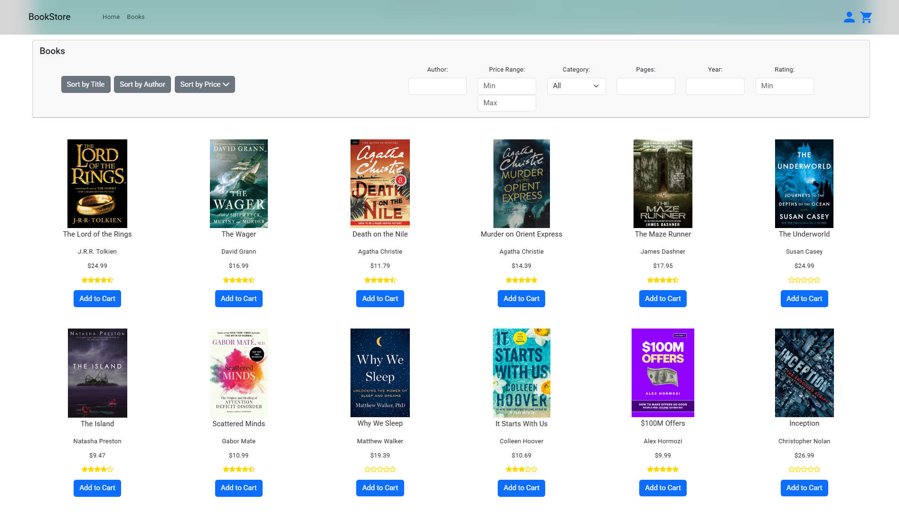

# Bookstore UI (Angular)

A simple, responsive frontend for a virtual bookstore built using Angular. This project showcases a clean UI design where users can browse, filter, and view book listings.

---

## Contents

- [Features](#features)  
- [Tech Stack](#tech-stack)  
- [Getting Started](#getting-started)   
- [Screenshots](#screenshots)

---

## Features

- Display a catalog of books with details like title, author, genre, and price
- Search, filter, and sort books by various parameters
- Responsive design with modern styling
- Component-based architecture following Angular best practices
- Mocked backend using in-memory data service

---

## Tech Stack

- **Angular** (15.2.0)  
- **TypeScript**
- **Bootstrap** 
- **SCSS / CSS**  
- **Angular Material**
- **RxJS**
- **Font Awesome** and **Bootstrap Icons**
- **Angular CLI**

---

## Getting Started

1. **Clone the repository:**

```bash
git clone https://github.com/vesc0/bookstore-ui-angular
cd bookstore-ui-angular
```

2. **Install dependencies:**
```bash
npm install
```

3. **Run the development server:**
```bash
ng serve
```

## Screenshots

